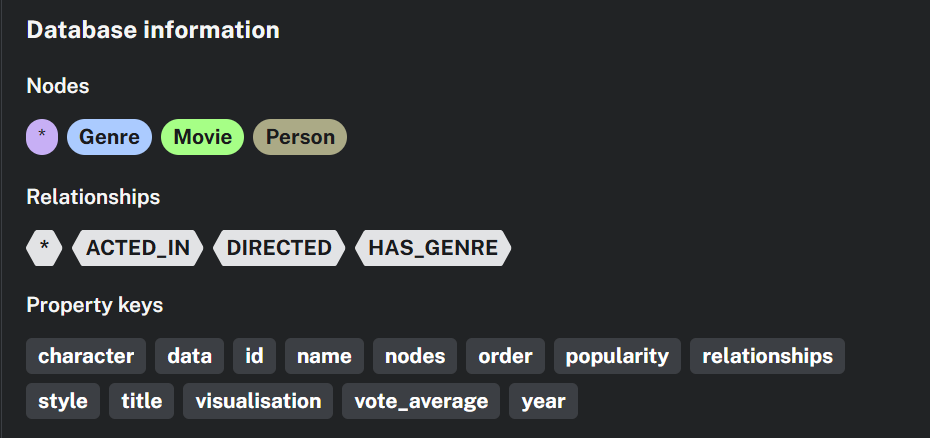

# MOVIE GRAPH

This project started as a learning step for building knowledge graphs using Neo4j database. 

I have used the TMDB 5000 Movie Dataset and imported all the data onto the database, populating nodes and creating relationships between the data. 


I have then created queries for searching movies, fetching movie details, movie recommandations, actor info, listing all the genres, sorting movie by genre. 

The movie recommendation logic is based on the score calculated 
1. finding all the co-actors and measure how many actors are in the movie and deciding a score based on how many actors the movies share
2. finding genre similarity the same way


Vibe-coded a simple UI

## Graph Model 
- Nodes: `Movie`, `Person`, `Genre` 
- Relationships: `ACTED_IN`, `DIRECTED`, `HAS_GENRE` 
- Common properties: `title`, `year`, `vote_average`, `name`, `character`, `order`

## Project Structure

- `api.py`: FastAPI app and Neo4j query endpoints
- `app.py`: interactive CLI movie explorer
- `graph.py`: graph/data related script(s)
- `data/`: CSV files used for graph population
- `static/index.html`: frontend UI

## Local Setup

1. Create and activate virtual environment
2. Install dependencies
3. Configure environment variables
4. Run FastAPI app

### Install

```powershell
python -m venv .venv
.venv\Scripts\Activate.ps1
python -m pip install -r requirements.txt
```

### Environment Variables

Create `.env` in the project root:

```env
URI=bolt://localhost:7687
AUTH=neo4j:your_password
```

## Run

```powershell
python -m uvicorn api:app --reload
```

Open: `http://127.0.0.1:8000`

## API Endpoints

- `GET /search?title=...`
- `GET /details?title=...`
- `GET /recommend?title=...`
- `GET /actor_info?name=...`
- `GET /genre_list`
- `GET /movie_by_genre?genre=...`

## Deployment Notes

This repo includes a `Procfile` for simple platform deployment:

- `web: uvicorn api:app --host 0.0.0.0 --port $PORT`

Required deployment env vars:

- `URI`
- `AUTH` (format: `username:password`)

## Notes

- If you use the attached screenshot, place it at `docs/database-information.png` so the README image renders.


